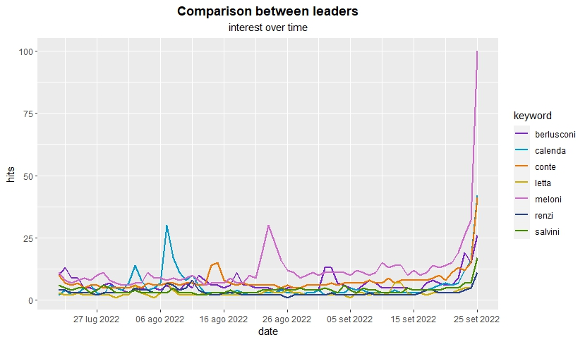

# The predictive capacity of Google Trends: *Italian parliamentary election of 2022*

## A project by ***Francesca Martinoli***: 

## **Introduction**

Polls and data analysis have always been widely used during electoral campaigns; the recent spread of the internet has allowed access to large amounts of new data. In this scenario, many studies have shown the elevate predictive capacity of Google Trends, as a tool for making data prediction either in social, economic or health field.

## **Question research**

Inspired by a [*Prado-Román's study*]{.underline} - ([Google Trends as a Predictor of Presidential Elections: the United States versus Canada](https://journals.sagepub.com/doi/pdf/10.1177/0002764220975067?download=true)), this project proposes to testing the hypothesis that the Google Trends tool have an elevate predictive capacity in anticipate the winner of the elections. The aim of this little study is to demonstrate the ability of Google Trends as a predictor of the winner of the Italian parliamentary election of 2022.

## **Data and Tools**

In order to get the data I need for my analysis, I used the [Google Trends](https://trends.google.it/trends/?geo=IT) API provided by Google, which allows to get data about search volume for single search terms or comparisons, over a selected time period. The results are return in a standardized measure: Google assign a measure of popularity to search terms, scaled between 0 and 100.

To interact with Google Trends API I used the `gtrendsR` package ([more info](https://github.com/PMassicotte/gtrendsR)), that allows to get data from Google Trends and displays them into a dataset with many information about interest over time (search volume), interest by country, region or city, related topics and related queries. For my purpose, I only used the data about `interest over time`, which contain information about the search volume for the single search terms I am interest in.

In this project I decided to analyze the data from the July 21st 2022, the day news elections were announced by President Mattarella, to the September 25th 2022, the "election day": they are the months of electoral campaigns.

For the analysis I transformed the variable `hits` into a numeric variable `hit_score`, recoding the value "\< 1" into zero. For the main dataset which contains all the keywords I need, I had to merge different dataset obtain through many interaction with Google Trend API, because this tool allows to get information only for 5 keywords at time. At last, in order to display the results I used the packages `ggplot2` to build plots and `plotly` to transform them into intercative plots, which I think are useful in this situation because some graphs are a little confused.

## **Work flow:**

The main steps for this analysis are:
-   Getting data from Google Trend API using the `gtrendsR` package
-   Clean and analyze the data for each political actor
-   Analyze the comparison between political leaders
-   Display a graphic visualization of the results
-   Conclusion

## Folders labels

| Folder | Contents |
| ----- | -----|
| data | it contains the datasets |
| figs | it contains the plots (format: .JPEG and .html) |
| final report | it contains the final report in .html and .rmd |
| scripts | it contains the scripts for the analysis | 

### References

-   [Camilo Prado-Román, Raúl Gómez-Martínez and Carmen Orden-Cruz, "**Google Trends as a Predictor of Presidential Elections: The United States Versus Canada**", *American Behavioral Scientist*, 2020](https://journals.sagepub.com/doi/pdf/10.1177/0002764220975067?download=true)

#### Research conducted by:

[Francesca Martinoli](https://github.com/martinoli-f)
